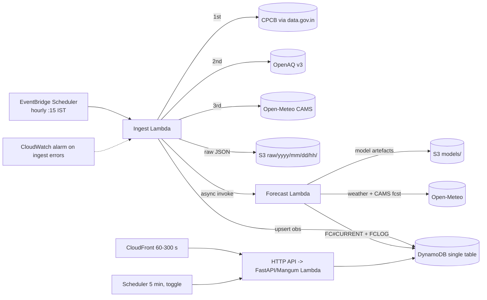

# BreatheWise — Core System Design

- Date: 2026-10-06
- Status: Draft for approval
- Scope: core system only (data, ML, AWS infrastructure, API, repo). The UI is specified separately and consumes the contract in §10.

## 1. Context and goals

BreatheWise is an explainable, personalised air-quality decision assistant for Delhi. For a given person, activity and duration, it answers:

1. Is it safe for me to do this now?
2. What is the best window in the next 12 hours?
3. Why is the air expected to change?

It will be presented live on real-time data at the Environmental Hacks event (Bharat Builds, WeMakeDevs x AWS, Air track) in Delhi on **Saturday 2026-10-10**. Work starts 2026-10-06, so there are four working days.

### Priorities
1. The live demo never breaks.
2. The MVP is polished.
3. Stretch features come last.

### Success criteria (core side)
- Ingest and forecast run hourly in AWS from Day 1 (2026-10-06) through the event, with ≥95% successful runs.
- Every dashboard endpoint returns a non-empty payload, including when all upstream sources fail (`stale: true` plus the data's age).
- On the held-out test window, LightGBM q=0.5 beats persistence on PM2.5 MAE for horizons h≥3 and beats raw CAMS for every horizon. Results go in `metrics.json`.
- The UI can be built entirely against `docs/fixtures/` from Day 1, and switched to the live API on Thursday afternoon by changing only the base URL.
- Read endpoints sustain about 100 concurrent users (smoke test) with p95 under 1 s through CloudFront.

## 2. Scope

**In scope:** NAQI computation, ingest with a fallback chain, a baseline forecast followed by LightGBM v1, TreeSHAP driver groups and templated explanations, the forecast log and scoreboard, replay episode export, the advisory engine with the best-window finder, the FastAPI backend behind CloudFront, `/health`, monitoring, and `UI_HANDOFF.md`.

**Cut** (because of the four-day timeline):
- ML v2 tuning.
- Stretch features S2 (exposure dose), S3 (SNS alerts) and S4 (agent Q&A).
- A full load test (a smoke test only).
- The GitHub Project board (issues with labels only).
- The requirement for seven days of live running before the event (realistically about 3.5 days).

**Conditional:** S1 (NASA FIRMS upwind fire count), only if Thursday's exit criteria are met by Thursday 18:00.

**Out of scope:** map view, school mode.

## 3. Ownership

| Area | Owner |
|---|---|
| Source clients, ingest Lambda, fallback chain | A (Ayush1860) |
| `naqi.py`, ML pipeline, SHAP groups, replay export | A |
| SAM infrastructure, forecast Lambda, deployment, monitoring | A |
| `advisory.py`, `rules.yaml`, `strings.yaml`, best-window finder | B |
| FastAPI backend, CloudFront, refresh/health, smoke load test | A |
| API contract, fixtures, `UI_HANDOFF.md` | A (author), B (consumer) |
| `/frontend` (separate UI prompt) | B, except the replay, scoreboard and accuracy (data-viz) views, which A owns |

B is invited as a collaborator in Phase 1. `main` requires a PR with green CI (`python` and `gitleaks`); once B accepts the invite, 1 approval from the other member is also required. Merges are rebase-only. `CODEOWNERS` reflects the table above.

## 4. Architecture

- **Compute:** three Python 3.12 Lambdas (ingest, forecast, api). No always-on compute, NAT, RDS or SageMaker.
- **Ingest trigger:** EventBridge Scheduler runs at minute 15 of every hour to absorb CPCB's 1–2 h lag. Ingest invokes forecast asynchronously when it finishes, so each forecast always uses the freshest observations.
- **Secrets:** API keys (data.gov.in, OpenAQ, later FIRMS) live in SSM Parameter Store as SecureString. They are created once via the AWS CLI by the user, because CloudFormation cannot create SecureString parameters. They are read at cold start and cached. Locally they come from `.env` (git-ignored); `.env.example` is committed.

## 5. Gates that must pass before dependent work

These are verification gates. The result of each is recorded in `ml/REPORT.md` or the PR description.

### G1 — Lambda packaging (Day 1, before any ML work)
- Build the forecast Lambda zip with `lightgbm` and `numpy`. `lightgbm` pulls in `scipy`; it is installed as a dependency, but the code does not import it.
- Build targets `manylinux` and Python 3.12 (`pip --platform manylinux2014_x86_64 --only-binary=:all:`).
- `libgomp` must be loadable. The `lightgbm` manylinux wheel bundles `lib_lightgbm.so`; check whether `libgomp.so.1` is vendored. If not, bundle it under `lib/`.
- Report the unzipped size, which must be under 250 MB.
- Deploy a probe function that runs `import lightgbm`, trains a 10-row dummy model and runs `predict(pred_contrib=True)`. This deploy needs cost approval (§13).
- **Fallback:** if anything fails, switch the forecast Lambda to an ECR container image (`public.ecr.aws/lambda/python:3.12`) the same day. Same code, different packaging.

### G2 — Archived forecasts vs reanalysis (Day 1–2, before feature engineering)
- Check what Open-Meteo actually offers as archived **forecasts**: the Historical Forecast API, the Previous Runs API, and the equivalent for the Air Quality (CAMS) API.
- **If archived forecasts are available** for the training window, then:
  - Weather features at t+h use the archived forecast issued at or before t.
  - CAMS features at t+h use the archived CAMS forecast issued at or before t.
- **If they are not available**, then:
  - The affected feature family is used **only at issue time t**: the latest analysis value at or before t, plus deterministic transforms of it.
  - Production uses exactly the same rule (it does not use live t+h forecasts) so that training and serving stay consistent.
  - The limitation is documented in `REPORT.md`.
- Weather and CAMS are decided independently. Reanalysis is never used as a stand-in for a forecast.

### G3 — Source shapes (Day 1, before parsers)
- Fetch a real sample from CPCB (data.gov.in), OpenAQ v3, Open-Meteo weather, and Open-Meteo Air Quality. Save the redacted samples to `ingest/tests/samples/`.
- Document field names, units, timezone and lag in `docs/sources.md`.
- Verify the data.gov.in resource ID before writing code against it.

## 6. Data

### Stations
- Choose 3–4 Delhi CPCB stations by measured coverage. Coverage is the share of hourly PM2.5 and PM10 present over the training window plus the last 30 days. Report it in `REPORT.md`.
- Each station is mapped to its OpenAQ location ID and its CAMS grid point (lat/lon).
- **Venue:** Delhi Technological University, Shahbad Daulatpur, Bawana Road, north-west Delhi (approx. 28.750 N, 77.117 E; coordinates to be verified).
- **Candidate venue stations:** Rohini (DPCC), Bawana (DPCC), Alipur, Narela, Jahangirpuri, Ashok Vihar and Wazirpur. The selection must include the closest candidate with ≥70% PM coverage.
- **Other stations:** fill the remaining slots with high-coverage stations in other parts of Delhi (for example Anand Vihar, a stubble-season hotspot), so that the replays and the model see a range of conditions.
- `VENUE_STATION_ID` is a config value, set to that venue station. The API reports the venue's `distance_km` honestly.
- The API returns `distance_km` from the user's location to the station.

### History
- Pull OpenAQ v3 hourly PM2.5, PM10, NO2, O3, CO and SO2 for the chosen stations, from as far back as coverage allows (target: 2023-01 onwards).
- Pull matching Open-Meteo weather and CAMS according to the G2 outcome.
- Data lives under `data/` (git-ignored) and is mirrored to `s3://<bucket>/data/`.

### Cleaning
- Store everything as UTC. Parse CPCB timestamps as IST and convert.
- Impute gaps of 3 hours or less by linear interpolation. Longer gaps stay NaN; LightGBM handles them natively.
- Drop physically impossible values (negative, or PM2.5 above 2000) and the stuck-sensor runs (the same value repeated for 6 h or more).
- Log coverage before and after cleaning.

## 7. NAQI (`backend/naqi.py`, pure, written test-first)

- Sub-index uses linear interpolation over the CPCB breakpoints listed in the project brief. Units are µg/m³, except CO in mg/m³.
- Before the module is finalised, the breakpoints are cross-checked against the official CPCB NAQI document. Any mismatch is flagged in the PR.
- **Gaps between breakpoint bands** (for example PM2.5 30–31): concentrations are rounded per CPCB practice (to the nearest integer for µg/m³ and one decimal for CO), then interpolated. Tests cover every band edge and every gap.
- **Values above the top band** use the upper anchor from the official CPCB document, if one is published, and are capped at 500. Which anchor is used is recorded in the cross-check.
- **Overall AQI** is the maximum sub-index. It is valid only with at least 3 pollutants, including PM2.5 or PM10. Otherwise the module returns `insufficient_data` with the list of pollutants present.
- **Averaging:**
  - `aqi` (headline, current): CPCB method. 24 h mean for PM, NO2, SO2 and NH3; maximum 8 h rolling mean for O3 and CO. Each window needs at least 16 of 24 hours (or 6 of 8) present.
  - `hourly_index` (approximation): NAQI breakpoints applied to the hourly concentration. Used for activity timing and the best window. It is documented as an indicative nowcast, not an official AQI.
- **Forecast index:** only PM2.5 and PM10 are forecast. The forecast index is the PM-based index (`max(sub_pm25, sub_pm10)`), labelled `basis: "pm_only"`. The three-pollutant validity rule applies to observed AQI only. This is documented in the handoff. In Delhi, PM is the dominant pollutant in nearly every hour.

## 8. Forecast model

### Targets
Hourly PM2.5 and PM10 at t+1 … t+12 for each station.

### Models
- Direct multi-horizon LightGBM: one model per (pollutant, horizon, quantile ∈ {0.1, 0.5, 0.9}), so 72 small models.
- **Why per-horizon models:** horizon-specific feature importance (which feeds the explanation story), simple leakage reasoning per horizon, and training time measured in seconds.
- All stations are pooled into each model, with `station_id` as a categorical feature.

### Features
Every feature is computed from information available at issue time t.

| Group (driver) | Features |
|---|---|
| Recent build-up | Target lags t-1, t-2, t-3, t-6, t-12, t-24; rolling mean and std over 3, 6 and 24 h; the other PM's lag-1 |
| Ventilation | u/v wind (from speed and direction, never raw degrees), boundary-layer height, at t and at t+h if G2 allows |
| Weather (counted under ventilation for grouping) | Temperature, relative humidity, precipitation, surface pressure |
| Regional pollution | CAMS PM2.5/PM10 at t+h if G2 allows, otherwise at t |
| Time-of-day pattern | sin/cos of hour (of the target hour t+h), sin/cos of day of week, month, festival flag (Diwali ±2 days, Dussehra, New Year) |
| Upwind fires (S1, conditional) | FIRMS fire count in an upwind sector over 24 h |

A leakage audit table (each feature, its source timestamp and its max lookahead) goes in `REPORT.md`. A unit test asserts that no feature at row t reads data after t, except the G2-approved archived forecasts.

### Split
- **Train:** everything up to 2025-10-05 23:00 IST.
- **Test:** 2025-10-06 to 2025-12-31. This covers the post-monsoon and stubble-burning season, the same regime as the event.
- Rolling-origin cross-validation within the training data (3 folds, expanding window) is used for early stopping and sanity checks only. Nothing is shuffled.
- **Replay episodes** come only from the test window.
- **Production model:** after evaluation, retrain on all data up to 2026-10-05 using the hyperparameters fixed during evaluation. Reported metrics come from the test-window model and are labelled that way.

### Baselines and metrics
- Baselines:
  - Persistence: y(t+h) = y(t).
  - Raw CAMS: the CAMS value at t+h if G2 allows, otherwise CAMS at t carried forward.
- Report MAE and RMSE per horizon per pollutant, interval coverage of [q0.1, q0.9], and the accuracy of the NAQI category from `hourly_index`. These go to `ml/metrics.json`, with the schema in §10.

### Post-processing
- Sort the three quantile outputs for each hour so that q0.1 ≤ q0.5 ≤ q0.9 (prevents quantile crossing).
- Clip predictions at 0 or above.

### Explainability
- Exact TreeSHAP via LightGBM `predict(pred_contrib=True)` on the q=0.5 models.
- Per-feature contributions are summed into the driver groups listed in the features table. The group contributions are signed, in µg/m³, stored per hour.
- The explanation is built from string keys, e.g. `explain.rising.ventilation` plus parameters. It is phrased as "the model expects PM2.5 to rise mainly because …" and never claims causation.
- The `shap` library is used only offline, for the plots in `REPORT.md`.

### Versioning
- Every forecast carries `model_version`:
  - `baseline-camsbias-v0`: CAMS at issue time plus a rolling 72 h station bias correction. This runs from Day 1 until LightGBM is deployed.
  - `lgbm-v1-<git short sha>`.
- The forecast log stores `model_version` in every entry. The scoreboard filters by `model_version`; its default is the currently deployed version, and it never mixes versions.

### Reproducibility
- `python -m ml.train --city delhi` produces the model artefacts and `metrics.json`.
- Artefacts are uploaded to `s3://<bucket>/models/<model_version>/`, never to git.

### Replay export
- `python -m ml.export_replay` selects 2–3 high-pollution episodes from the test window (for example, the onset of a "Severe" spell).
- For each episode it exports, hour by hour:
  - observed values and the forecast (q0.1/0.5/0.9) for both PMs;
  - the index and band;
  - driver groups and explanation keys;
  - verdicts for every profile × activity combination;
  - persistence and CAMS baselines.
- Output goes to `docs/fixtures/replay/<episode_id>.json`, which the UI bundles.

## 9. Ingest

**Fallback chain for each station:**
1. CPCB (data.gov.in).
2. OpenAQ v3.
3. Open-Meteo CAMS grid point. This source is labelled `source: "cams_model"` so the UI can say "modelled estimate".

**How each run works:**
- Each source client has a 10 s timeout and 3 retries with exponential backoff and jitter. Responses are validated with pydantic.
- A missing station or pollutant in one source moves to the next source **for that station only**.
- Every run re-fetches the last **3 hours**.
- Writes are idempotent upserts keyed by `STATION#id / OBS#<utc hour>`. A later CPCB backfill overwrites an earlier lower-priority source (`cams_model` < `openaq` < `cpcb`). It never overwrites a higher-priority source with a lower one.
- Raw responses go to S3 under `raw/yyyy/mm/dd/hh/<source>.json`.
- After a successful write, `LATEST` is updated (with a conditional write, so it only moves forward in time).
- The `META / HEALTH#<source>` record stores the last success, the last failure and the error class.

**Monitoring:** a CloudWatch alarm on the ingest Lambda `Errors` metric (≥2 in 2 h), plus a custom metric `StationsWithFreshData`.

## 10. Storage and API contract

### DynamoDB single table `breathewise` (on-demand)

| PK | SK | Item | TTL |
|---|---|---|---|
| `STATION#<id>` | `OBS#<utc>` | Hourly observation: pollutants, source, `ingested_at` | 30 d |
| `STATION#<id>` | `LATEST` | Last good observation plus computed `aqi` | none |
| `STATION#<id>` | `FC#CURRENT` | Latest forecast document | none |
| `STATION#<id>` | `FCLOG#<model_version>#<target_utc>#<issued_utc>` | Predicted q0.1/0.5/0.9, index, band, driver groups | 30 d |
| `META` | `HEALTH#<source>` | Source health | none |
| `META` | `REFRESH_LOCK` | Global refresh rate limit (conditional write) | 5 min |
| `META` | `STATIONS` | Station registry | none |

Putting `model_version` first in the `FCLOG` sort key lets the scoreboard query by `begins_with(model_version)`.

### API
FastAPI, run on Lambda through Mangum, with HTTP API in front of it and CloudFront in front of that.

| Endpoint | Cache | Notes |
|---|---|---|
| `GET /stations?lat&lon&radius_km` | 300 s | Includes `distance_km` and coverage |
| `GET /aqi/current?lat&lon` or `?station_id` | 60 s | `aqi` or `insufficient_data`, sub-indices, dominant pollutant, `source`, `station_name`, `distance_km`, `observed_at`, `stale`, `age_minutes` |
| `GET /aqi/forecast?station_id` | 60 s | 12 hours of {q10, q50, q90 for each PM, `hourly_index`, band, `drivers{group: µg/m³}`, `explanation{key, params}`}, plus `model_version` and `issued_at` |
| `POST /advice` | none | Request {profile, activity, duration_h, station_id}. Response {verdict, reason_key, advice_keys[], best_window{start, end, max_index, band}, basis} |
| `GET /scoreboard?station_id&model_version` | 300 s | Pairs of past forecasts and actuals, MAE per horizon (since launch, up to 7 d), n per horizon |
| `GET /metrics` | 300 s | Contents of `metrics.json` |
| `POST /refresh?station_id` | none | 202, or 429 with `retry_after_s`; global 5-min lock |
| `GET /health` | none | Last success per source and station, last forecast time, `model_version` |

**Behaviour common to all endpoints:**
- Every response has `generated_at` (UTC).
- Every data object has `source` and `observed_at` or `issued_at`.
- When data is missing, endpoints return the last good data with `stale: true` and `age_minutes`. They never return an empty dashboard payload.

**Contract artefacts:**
- The pydantic models in `backend/schemas.py` are the source of truth.
- `docs/openapi.json` is generated from them.
- `docs/fixtures/*.json` cover these states: fresh, stale, insufficient_data, `cams_model` fallback, refresh 429, and replay.
- Status: **final** once reviewed by A at the end of Phase 1. After that, changes are additive only, and any breaking change needs a version bump and a note to B.

## 11. Advisory engine (`backend/advisory.py`, written test-first)

- **Rules** live in `backend/rules.yaml`. The base table maps each NAQI category to a verdict for a healthy adult doing light activity, based on CPCB health statements.
- **Shifts:**
  - Sensitive profiles (respiratory, heart, child, elderly, pregnant) shift one category stricter.
  - Exertion activities (run/exercise, cycling commute) shift one category stricter.
  - Shifts stack, capped at Severe.
  - Outdoor workers map AVOID → REDUCE_EXPOSURE, with protection advice.
- **Verdicts:** GO, GO_WITH_N95, AVOID, REDUCE_EXPOSURE.
- **Profiles:** healthy_adult, respiratory, heart, child, elderly, pregnant, outdoor_worker.
- **Activities:** walk, run_exercise, cycling_commute, two_wheeler_commute, kids_outdoor_play, outdoor_work_shift.
- **Best-window finder:** the contiguous window of `duration_h` within the 12 h forecast whose worst hourly index is lowest. Ties go to the earliest window. The q0.9 band is used for sensitive profiles and q0.5 for everyone else. If no window improves on now, it says so.
- **Strings:** all user-facing text lives in `backend/strings.yaml` under stable keys (`verdict.*`, `reason.*`, `advice.*`, `explain.*`). The API returns keys plus params, and also returns the rendered English text for convenience.

## 12. Live-demo resilience

- **Stale fallback** in every read path: `FC#CURRENT` older than 2 h, or `LATEST` older than 3 h, is returned with `stale: true`. The API never returns 5xx for missing data.
- **Source failure simulation** (Thursday): use an environment flag `FORCE_FAIL=cpcb,openaq` on the ingest Lambda and verify the fallback chain and the `/health` output.
- **Warm-up:** a 5-min Scheduler ping to `/health`, disabled by default and enabled on Friday.
- **Smoke load test:** `locust` or `hey` sending 100 concurrent users to CloudFront for the read endpoints. Record p95 latency.
- **Offline replay:** replay JSON is bundled in the frontend, so the demo works without network access.
- **Freeze:** no merges to `main` after Friday 18:00 IST.

## 13. Infrastructure and cost

- **SAM:** `infra/template.yaml`, `infra/samconfig.toml`. The stack is `breathewise-prod` in A's account, region ap-south-1 (Mumbai). Any dev stack is named `breathewise-dev-<initials>`.
- **Resources:**
  - Three Lambdas (arm64 where wheels allow, otherwise x86_64).
  - EventBridge Scheduler: hourly ingest, plus the 5-min warm-up (disabled).
  - DynamoDB on-demand with TTL.
  - S3 bucket, private, with lifecycle rules (`raw/` expires at 30 d).
  - HTTP API with stage throttling (50 rps, burst 100).
  - CloudFront distribution.
  - SSM parameters.
  - CloudWatch log groups (14 d retention) and alarms.
- **Cost gate:** before every `sam deploy` or resource creation, the resource list and estimated monthly cost are shown and explicit approval is required. The account uses the post-July-2025 credit-based free plan. Every service above is in the always-free allowances at this traffic level; ECR (the G1 fallback) would draw small amounts from the credits.
- **Budget alert:** an AWS Budgets $1 alert. The command is provided; the user runs it.

## 14. Repository and workflow

- **Layout:** as in the project brief (`/backend`, `/ingest`, `/ml`, `/frontend`, `/infra`, `/docs`, `/.github`).
- **No AI-tool-specific files or attributions** are committed. Agent instructions stay in local git-ignored files; shared conventions go in `CONTRIBUTING.md`.
- **Process:**
  - Conventional Commits.
  - Branches named `<initials>/<area>-<short-desc>`.
  - One feature per branch per PR; PRs reference issues; issues are labelled (`ml`, `data`, `infra`, `backend`, `frontend`, `ux`, `demo`).
  - Worktrees for parallel branches.
- **CI** (GitHub Actions): `ruff`, `black --check`, `pytest`, `sam validate`; frontend lint, typecheck and build jobs are stubbed.
- **Branch protection on `main`:** PR plus green CI. One approval becomes required once B is a collaborator.
- **Environment:** Python 3.12. Local Python 3.11 needs upgrading, or use `uv` to manage 3.12.

## 15. Schedule

| Day | Work (A) | Exit check |
|---|---|---|
| Tue 6 Oct | Scaffold, CI, contract and fixtures (final), G3 samples, station choice, `naqi.py` (TDD), G1 probe, SAM stack with ingest and baseline forecast deployed | Hourly runs green in CloudWatch; S3 and DynamoDB filling; `FCLOG` entries with `baseline-camsbias-v0` |
| Wed 7 Oct | G2, history pull, features with leakage test, LightGBM v1, metrics, TreeSHAP groups, model deployed. In parallel: the API on local storage. (B: `advisory.py` plus best window, TDD) | `metrics.json` meets the §1 criteria; live `FC#CURRENT` has drivers; API tests pass against fixtures |
| Thu 8 Oct | API deployed behind CloudFront, wired to DynamoDB. **`UI_HANDOFF.md` by 12:00.** Replay export, scoreboard, failure simulation, `REPORT.md` | B can call the live API; replay JSON validates; forced failures degrade gracefully |
| Fri 9 Oct | Smoke load test, warm-up on, S1 if time allows, freeze 18:00, rehearsal | p95 under 1 s; no open P0 issues |

## 16. Risks and open items

| Item | Mitigation |
|---|---|
| Nearest stations to DTU (north-west Delhi) may have patchy coverage | Choose by measured coverage among the candidates; `distance_km` is shown honestly |
| CPCB on data.gov.in is unreliable or lagging | Fallback chain; the `source` field is shown honestly |
| G1 fails (size or `libgomp`) | Switch to ECR the same day |
| G2 shows no archived forecasts | Issue-time-only features; documented limitation |
| Only about 3.5 days of scoreboard history | Show "since launch" and the n per horizon honestly |
| Global git email `ayushsuryawanshi9@gmail.com` may not be verified on GitHub account Ayush1860 | Verify before the first push so commits are attributed |
| Local Python is 3.11 | Install 3.12 or use `uv` before the scaffold |
